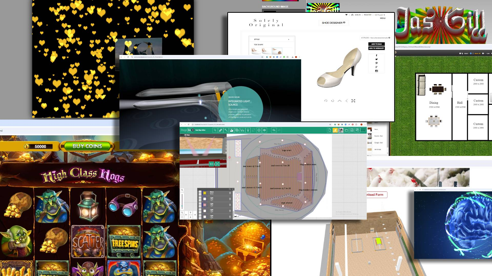

# WebGL, Three.js | AI | Full-Stack | Blockchain Expert

   
  ✅ WebGL & Three.js – I craft high-performance, immersive 3D experiences for web-based applications, including interactive visualizations, metaverse projects, and real-time 3D environments. Whether it's physics-based simulations or custom-built 3D tools, I ensure smooth performance across all devices. 
  ✅ Blockchain Development – I have extensive experience in smart contracts, dApps, NFTs, DeFi protocols, and Web3 integrations. I’ve worked with Ethereum, Solana, and Polygon to build secure and scalable decentralized applications. 
  ✅ AI & NPC Development – I develop AI-driven NPCs with unique personalities, text-to-speech, and lip-sync capabilities, bringing characters to life in games, virtual assistants, and interactive storytelling applications. 
  ✅ Optimization & Performance – Whether it’s improving WebGL performance, gas-efficient smart contracts, or AI model optimization, I ensure smooth, efficient, and scalable solutions. 

  

<h2>About My Skills</h2>

<table align="center">
  <tr>
    <td align="center" width="90">
      
       Three.js
    </td>
    <td align="center" width="90">
      
       AI
    </td>
    <td align="center" width="90">
      
       Blender
    </td>
    <td align="center" width="90">
      
       Next.js
    </td>
    <td align="center" width="90">
      
       Vue
    </td>
    <td align="center" width="90">
      
       Nuxt.js
    </td>
    <td align="center" width="90">
      
       CSS
    </td>
    <td align="center" width="90">
      
       Bots
    </td>
    <td align="center" width="90">
      
       Figma
    </td>
    <td align="center" width="90">
      
       Django
    </td>
  </tr>
  <tr>
    <td align="center" width="90">
      
       React
    </td>
    <td align="center" width="90">
      
       Javascript
    </td>
    <td align="center" width="90">
      
       PHP
    </td>
    <td align="center" width="90">
      
       Nodejs
    </td>
    <td align="center" width="90">
      
       Python
    </td>
    <td align="center" width="90">
      
       MongoDB
    </td>
    <td align="center" width="90">
      
       MySQL
    </td>
    <td align="center" width="90">
      
       PostgreSQL
    </td>
    <td align="center" width="90">
      
       Firebase
    </td>
    <td align="center" width="90">
      
       Linkedin
    </td>
  </tr>
  <tr>
    <td align="center" width="90">
      
       Flutter
    </td>
    <td align="center" width="90">
      
       Android
    </td>
    <td align="center" width="90">
      
       MaterialUI
    </td>
    <td align="center" width="90">
      
       Tailwind
    </td>
    <td align="center" width="90">
      
       Typescript
    </td>
    <td align="center" width="90">
      
       Styled
    </td>
    <td align="center" width="90">
      
       NFT
    </td>
    <td align="center" width="90">
      
       DeFi
    </td>
    <td align="center" width="90">
      
       Solidity
    </td>
    <td align="center" width="90">
      
       Rust
    </td>
  </tr>
</table>

<h2>My Work Portfolios</h2>

  <table>
    <tr>
    <td colspan="10">
      
    </td>
  </tr>
  </table>
